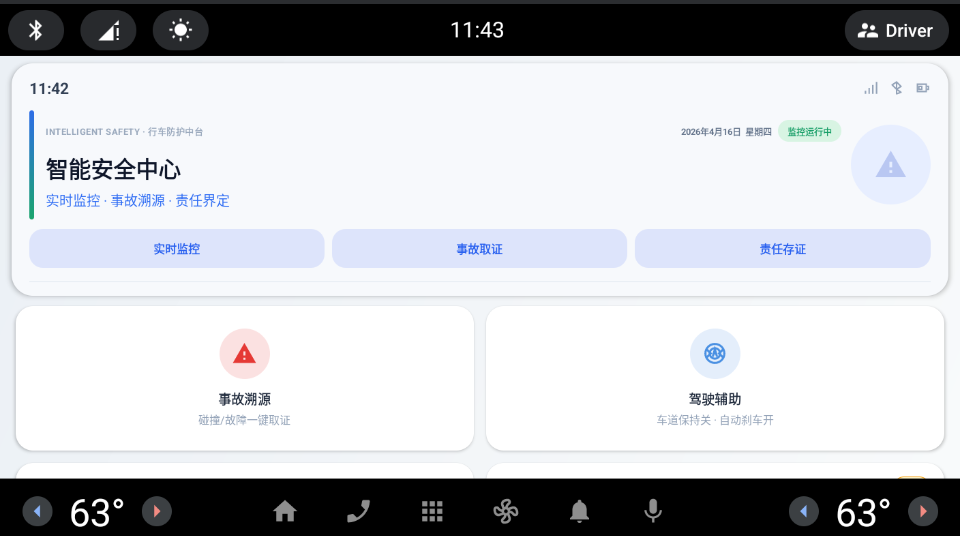
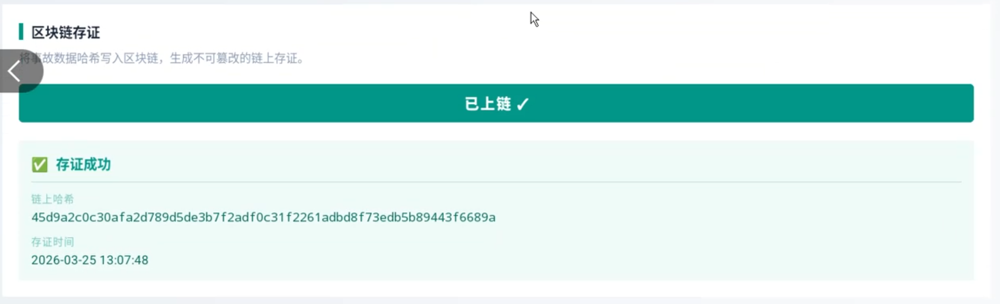
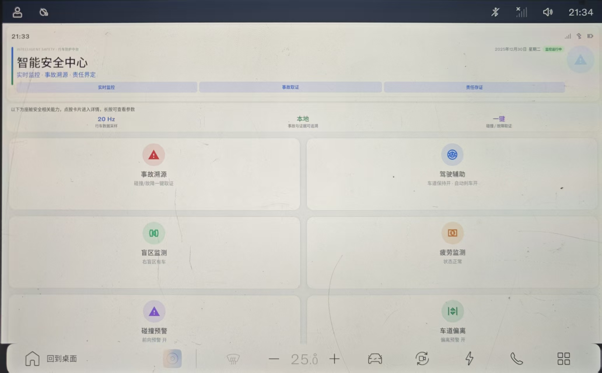

# VehTrust — 车载智能安全监控与事故可信存证工程

> **平台**：Android Automotive（AAOS）  
> **客户端语言**：Kotlin  
> **服务与训练**：Python（FastAPI + scikit-learn）  
> **链上能力**：Hyperledger Fabric Chaincode + Go API（独立子工程）

---

## 目录


- [项目概览](#项目概览)
- [功能演示](#功能演示)
- [核心能力](#核心能力)
- [端到端流程](#端到端流程)
- [仓库结构](#仓库结构)
- [Android 客户端说明（`app/`）](#android-客户端说明app)
- [AI 后端与模型说明（`backend/`）](#ai-后端与模型说明backend)
- [区块链子工程说明（`chaincode_and_api/`）](#区块链子工程说明chaincode_and_api)
- [CarExt SDK 资料目录说明（`ecarx-carext-sdk/`）](#carext-sdk-资料目录说明ecarx-carext-sdk)
- [数据信息](#数据信息)
- [快速启动](#快速启动)
- [联调配置说明](#联调配置说明)
- [当前工程边界](#当前工程边界)
- [APK 下载与车机适配](#apk-下载与车机适配)
- [车机 UI 适配说明](#车机-ui-适配说明)

---

## 项目概览

`VehTrust` 是一个面向车载场景的综合安全工程，目标是打通“**安全状态感知 → 事故触发取证 → 责任分析解释 → 可信存证**”的完整链路。  
当前仓库由四个核心部分组成：

- **🚗 Android App（`app/`）**：安全中心、事故列表、事故详情、责任分析、AI 文本分析、本地严重度推理与上链接口调用。
- **🧠 AI Backend（`backend/`）**：事故分析 API（OpenAI 驱动）及严重度模型训练/导出工具链。
- **🔗 链码与网关 API（`chaincode_and_API/`）**：Fabric 链码与 Go HTTP 网关，负责数据上链与查询。
- **📚 CarExt SDK 资料集（`EcarX-CarExt-SDK/`）**：ECARX 能力接口源码、Javadoc 与参数资产，用于参数映射与后续真实车机接入参考。

## 功能演示

> 💡 视频演示请访问：<a href="https://gr3e3n.github.io/VehTrust/video-demo.html" target="_blank">**click me**</a>


- **📹 事故溯源分析** — 详情页完整分析流程（责任界定、关键指标、AI报告、严重度推理、上链）
- **⛓️ 数据上链** — Hyperledger Fabric 链码存证全过程
- **🚗 综合功能展示** — 安全中心模块、事故列表、页面交互漫游

> 🖼 界面截图

| 截图 | 说明 |
|------|------|
|  | 安全中心主页概览 |
|  | 区块链上链操作成功确认 |
|  | 车机版 UI — 字号/间距/触控区域全面放大，适配车载中控屏 |
---

## 核心能力


| 能力 | 说明 |
| --- | --- |
| 🖥️ 安全中心可视化 | 模块卡片展示驾驶辅助、疲劳监测、车道与碰撞预警、雨天与乘员安全等状态 |
| 📼 EDR 事故取证链路 | 前台服务常驻 + 20Hz 采样 + 环形缓冲 + 触发冻结事故前后窗口 |
| ⚖️ 责任界定（可解释） | 输出驾驶员 / 系统 / 环境三方占比，并展示反应时间、TTC、制动上升时间等关键指标 |
| 📉 本地严重度推理 | 端侧离线推理 `Fatal / Serious / Slight`，不依赖在线服务 |
| 🤖 AI 结构化报告 | 调用后端生成事故摘要、根因、证据点和改进建议（失败时支持本地回退） |
| ⛓️ 链上可信存证 | 通过链码网关提交数据摘要并回查结果 |

---

## 端到端流程

安全监测触发 → 事故数据冻结与回放 → 责任分析与证据整理 → AI 文本报告生成 → 链上存证与查询。

该流程同时支持：

- **在线增强**：调用后端生成更完整的事故分析报告。
- **离线可用**：即使后端不可用，仍可完成本地严重度推理与核心取证链路。

---

## 仓库结构

```text
VehTrust/
├── app/                         # Android 客户端
├── backend/                     # FastAPI + ML 训练/导出
├── chaincode_and_API/           # Fabric 链码与 Go API
├── EcarX-CarExt-SDK/            # CarExt SDK 资料与参数资产
├── data/                        # 数据集
│   └── uk-dft-2024/             #   DfT 2024 道路安全训练数据
├── demo/                        # 演示素材（视频+截图）
│   ├── analysis.mp4             #   事故溯源分析演示视频
│   ├── chain.mp4                #   区块链上链演示视频
│   ├── pre.mp4                  #   综合功能展示视频
│   ├── pre.png                  #   主界面截图
│   └── chain.png                #   上链成功截图
├── VehTrust_Carui/              # 车机大屏 UI 适配资源
│   ├── VehTrust_CarScreen.apk   #   车机版安装包
│   ├── change.md                #   UI 逐项变更说明文档（代码级）
│   └── vehtrust_carui_changes.zip # 改动资源压缩包(解压覆盖即用)
├── VehTrust.apk                 # 标准版 Android 安装包
├── video-demo.html              # 在线视频演示播放页
├── info.txt                     # 车机参数映射资产
└── README.md
```

---

## Android 客户端说明（`app/`）

### 📌 关键页面


- **`MainActivity`**：安全中心首页，展示模块状态并启动监控服务。
- **`ModuleDetailActivity`**：模块参数详情页，按 `ModuleCatalog` 展示只读参数映射。
- **`AccidentTraceActivity`**：事故事件列表。
- **`AccidentTraceDetailActivity`**：事故详情（遥测、责任分析、AI 结果、本地严重度、上链操作）。

### 🧩 关键链路

- **监控服务**：`service/AccidentMonitorService.kt`
- **采样与触发**：`trace/AccidentMonitor.kt`
- **数据仓库**：`trace/AccidentRepository.kt`
- **责任分析**：`trace/ResponsibilityAnalyzer.kt`
- **AI 分析接口**：`trace/OpenAiAnalysisApi.kt`
- **本地严重度推理**：`trace/CollisionSeverityApi.kt`
- **链上提交接口**：`trace/BlockchainApi.kt`

### 💾 数据持久化


使用 Room 保存事故链路数据：

- `db/AccidentEventEntity`
- `db/TelemetryEntity`
- `db/ResponsibilityEntity`
- `db/EvidenceEntity`

---

## AI 后端与模型说明（`backend/`）

### FastAPI 服务

- 入口：`backend/main.py`
- 主要接口：
  - `GET /health`
  - `POST /api/accident/analyze`
- 配置来源：`backend/.env`（`OPENAI_API_KEY`、`OPENAI_MODEL`）

### 严重度模型训练与导出

- 训练脚本：`backend/ml/train_collision_severity.py`
- 导出脚本：`backend/ml/export_collision_severity_runtime.py`
- 默认训练数据路径：
  - `data/uk-dft-2024/dft-road-casualty-statistics-collision-2024.csv`
  - `data/uk-dft-2024/dft-road-casualty-statistics-vehicle-2024.csv`
- 训练产物：`backend/ml/artifacts/`
- 端侧运行时模型：`app/src/main/assets/collision_severity_model.json`

详细流程见：`backend/严重度模型与深度学习流程说明.md`

---

## 区块链子工程说明（`chaincode_and_API/`）

该目录是独立链上子工程，包含：

- **Fabric 链码**：`mychaincode/go/asset.go`
- **Go 网关 API**：`carscreen-api/main.go`

网关提供 `/upload` 与 `/query` 接口；链码提供 `UploadVehicleData` 与 `QueryVehicleData`。  
运行依赖 Docker、Fabric 网络、Go 环境和 `peer` CLI，请按该目录内 `README.md` 进行部署。

> 注意：该子工程中仍保留历史命名（如 `carscreen-api`）和示例路径（Linux 本地路径），属于其独立运行配置范畴。

---

## CarExt SDK 资料目录说明（`EcarX-CarExt-SDK/`）

该目录用于提供 ECARX 能力参考，不作为当前 `app` 的直接编译依赖源。主要包含：

- `sources/`：接口源码（`ecarx.carext.*`）
- `docs/`：Javadoc
- `OVERVIEW.md`：能力总览文档
- `info.txt`：提取参数信息

当前 Android 端通过 `ModuleCatalog` 与 `MockDataProvider` 做参数映射展示，后续可按该目录能力逐步接入真实车机数据源。

---

## 数据信息

### 训练数据

目录：`data/uk-dft-2024/`

- `dft-road-casualty-statistics-collision-2024.csv`
- `dft-road-casualty-statistics-vehicle-2024.csv`
- `dft-road-casualty-statistics-road-safety-open-dataset-data-guide-2024.xlsx`

### 演示资源

| 文件 | 说明 |
|------|------|
| `demo/analysis.mp4` | 事故溯源分析演示视频 |
| `demo/chain.mp4` | 区块链上链演示视频 |
| `demo/pre.mp4` | 综合功能展示视频 |
| `demo/pre.png` | 主界面截图 |
| `demo/chain.png` | 上链成功截图 |
| `video-demo.html` | 在线视频播放页（GitHub Pages 部署） |

---

## APK 下载与车机适配

### 📱 安装包

| 版本 | 说明 | 下载 |
|------|------|------|
| **标准版** | 适配模拟设备的 Android 安装包 | [VehTrust.apk](VehTrust.apk) |
| **车机版** | 车载中控大屏优化版（字号/间距/触控区域全面放大） | [VehTrust_CarScreen.apk](VehTrust_Carui/VehTrust_CarScreen.apk) |

> 💡 **车机版与标准版功能完全一致**，仅 UI 层面按车载场景做了全面视觉放大。详见下方「车机 UI 适配说明」。

---

## 快速启动

### 1) Android App

```bash
# 在项目根目录
.\gradlew.bat :app:assembleDebug
```

或直接使用 Android Studio 打开工程运行 `app` 模块。

### 2) 后端服务（可选）

```bash
cd backend
pip install -r requirements.txt
python -m uvicorn main:app --host 0.0.0.0 --port 8080 --reload
```

健康检查：`http://127.0.0.1:8080/health`

### 3) 重新训练并导出本地严重度模型（可选）

```bash
pip install -r backend/requirements-train.txt
python backend/ml/train_collision_severity.py
python backend/ml/export_collision_severity_runtime.py
```

---

## 联调配置说明

- **OpenAI 分析 API 地址**：`app/src/main/java/com/example/vehtrust/trace/OpenAiAnalysisApi.kt`（默认 `10.0.2.2:8080`）
- **区块链接口地址**：`app/src/main/java/com/example/vehtrust/trace/BlockchainApi.kt`（默认局域网地址）
- **后端密钥配置**：`backend/.env`（已在 `.gitignore` 中忽略）

---

## 当前工程边界

- 安全中心模块状态目前主要来自 `MockDataProvider`，用于演示 UI 和风险规则。
- 事故监控触发逻辑已具备完整链路结构，但真实车机属性接入仍需替换采样来源。
- 区块链子工程依赖外部 Fabric 网络与本地环境配置，需单独部署后再联调。

---

## 车机 UI 适配说明

> **适配目标**车载中控大屏设计规范，将原手机端 UI 升级为**车机屏幕可读、可触控**的大屏版本。  
> **核心原则**：功能逻辑完全不变，仅调整视觉尺寸与布局结构。

### 改动概览

| 维度 | 手机端原值 | 车机适配后 |
|------|-----------|-----------|
| 视距 | 手持 25~50cm | 座椅距离 50~100cm |
| 最小触控区 | 44dp | ≥66dp |
| 字号基准 | 正文 11~14sp | 17~27sp |
| 间距节奏 | 4/8/12dp | 8/14/18~26dp |
| 圆角风格 | 中等圆润 16~18dp | 大圆角 24~28dp |
| 阴影层次 | 轻 2~3dp | 中等 5~8dp |
| 颜色管理 | 硬编码为主 | 统一 `@color` 引用 |

### 使用方式

**方式一（推荐）— 直接替换**：

下载 [vehtrust_carui_changes.zip](VehTrust_Carui/vehtrust_carui_changes.zip)，解压后覆盖 `app/src/main/res/` 对应子目录即可编译使用。

**方式二 — 手动修改**：详见变更文档 [change.md](VehTrust_Carui/change.md)（包含每个文件的逐行代码对照与全文可复制代码块）。

### 涉及文件（共 14 个）

- **Layout（6个）**：`activity_main.xml`、`activity_accident_trace.xml`、`activity_accident_trace_detail.xml`、`activity_module_detail.xml`、`item_safety_module.xml`、`item_accident_event.xml`
- **资源（2个）**：`values/colors.xml`、`values/strings.xml`
- **Drawable（6个）**：`bg_header_accent_strip.xml`、`bg_header_status_pill.xml`、`bg_header_chip.xml`、`bg_header_ornament_circle.xml`、`bg_mid_bridge.xml`、`bg_param_panel.xml`

> 以上所有改动仅涉及 **UI 资源层**（XML 布局 + 颜色 + 字符串 + shape drawable），**Kotlin/Java 业务代码无需任何修改**。


---


